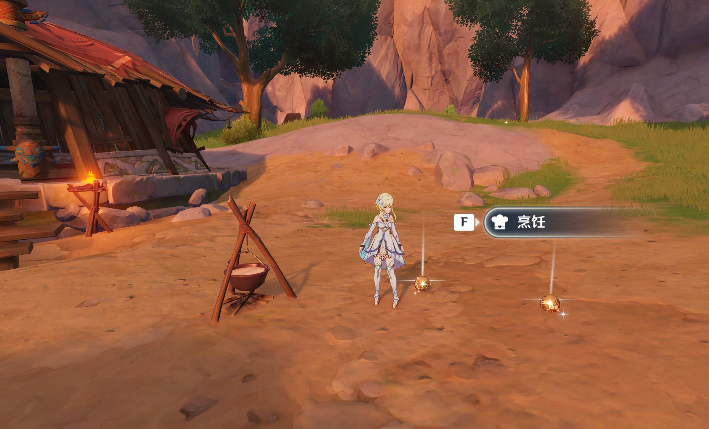

# Drop

> 自定义屏蔽掉落物拾取提示框的轻量插件

<div align="center">


一款拦截拾取提示框 UI 的插件,支持白名单与热重载。



*掉落物不再弹出拾取提示框,正常交互(烹饪)不受影响*

</div>

---

## ⚠️ 免责通知

> **本插件仍处于测试阶段**,强烈不建议在正式服或主要账号上使用。
>
> 使用本插件产生的任何后果(包括但不限于封号、数据异常等)均由使用者自行承担。

---

## 🛡️ 关于封号风险(必读)

目前了解游戏内 Intee(拾取/交互)系统本身带有 **speed check(速度校验)**——创建交互对象时会传入`closeInitSpeedCheck` 等参数;

此前有用户反馈使用插件后被封禁,从机制上看**可能是利用了速度相关的 bug**,而非本插件本身。就目前观察,7.0更新后疑似放开了数据异常效验,目前使用本插件不会导致踢出或封禁。


---

## 📦 安装

略；支持主流启动器的插件安装

安装完成后将以下文件部署到DLL同级目录:

```
目录/
├── Drop.dll                 # 插件主 DLL
├── Config.ini               # 主配置文件
├── Whitelist.ini            # 白名单配置文件
└── Blacklist.ini            # 黑名单配置文件
```

---

## 🚀 使用方法

### 配置项 (`Config.ini`)

```ini
[PickupFilter]
Name  = 屏蔽怪物掉落物
Type  = bool
Value = 1   ; 1 = 开启,0 = 关闭,默认屏蔽怪物掉落物

[Whitelist]
Name  = 白名单启用
Type  = bool
Value = 1   ; 1 = 启用白名单,0 = 关闭

[Blacklist]
Name  = 黑名单启用
Type  = bool
Value = 1   ; 1 = 启用黑名单,0 = 关闭

[Log]
Name  = 日志开关
Type  = bool
Value = 1   ; 1 = 输出日志,0 = 静默
```

### 白名单 / 黑名单 (`Whitelist.ini` / `Blacklist.ini`)

名单文件各分两个区: `[Text]` 按名称精确匹配, `[Icon]` 按图标子串匹配:

```ini
[Text]
史莱姆凝液

[Icon]
UI_ItemIcon_112
```

判定顺序为 黑名单 > 白名单 > 默认(掉落物默认拦 112 图标族, 交互条目默认放行)。

---

使用 [MinHook](https://github.com/TsudaKageyu/minhook),完整授权声明见 `src/MinHook` 源码文件头

---
## 🤝 反馈与贡献

- 🐛 提交 Issue:遇到崩溃、漏拦、误拦等情况
- 💡 提出建议:功能优化或新特性想法
- 🔧 提交 PR:欢迎改进代码与文档

---

<div align="center">

**❤️ by [ChengChe-yi](https://github.com/ChengChe-yi)**

</div>
